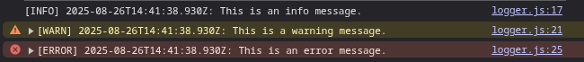
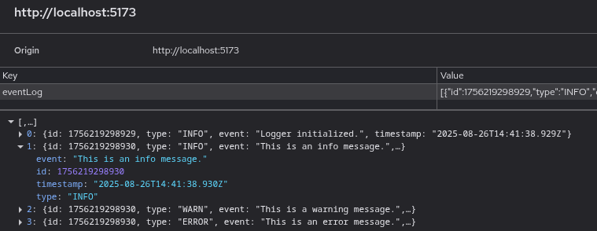
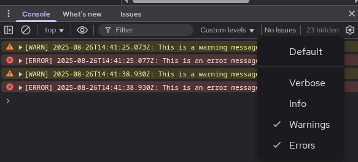

[NodeJS package](https://www.npmjs.com/package/i45-jslogger)

A basic, browser based, logger to track events during development and testing. Log entries are written to the console as well as stored in localStorage.

A useful tool for debugging.

## Installation

```javascript
npm i i45-jslogger
```

## Usage

```javascript
import { Logger } from "i45-jslogger";

var logger = new Logger();

logger.info("This is an info message.");
logger.warn("This is a warn message.");
logger.error("This is an error message.");
```

Console output:


Local storage output:


## Logging Levels

Set logging levels in the Console.

Console set to display warning and errors only.


## Class/Module Usage

```javascript
import { Logger } from "i45-jslogger";

export class MyClass {
  // private field for logging.
  #loggingEnabled;
  #logger;

  constructor() {
    this.#loggingEnabled = false;
    this.#logger = new Logger();
  }

  enableLogging(value = false) {
    if (typeof value !== "boolean") {
      // if logging is enabled, the error will be logged and also thrown to stop further processing.
      // the second parameter, throwError, determines if the error is thrown or not.
      this.#error(`The method enableLogging() expected a boolean, but got ${typeof value}`, true);
    }
    this.#loggingEnabled = value;
  }

  doSomething(){

    //... method code

    // log the action.
    this.#info("We've just done somethings".);
  }

  #info(message, ...args){
    if(this.#loggingEnabled){
      this.#logger.info(messge, ...args);
    }
  }

  #warn(message, ...args){
    if(this.#loggingEnabled){
      this.#logger.warn(message, ...args);
    }
  }

  #error(message, throwError = false, ...args){
    if(this.#loggingEnabled){
      this.#logger.error(message, ...args);
    }

    // Even when logging is disabled, an error can be thrown when necessary.
    if(throwError){
      throw new Error(message, ...args);
    }
  }
}

var myClass = new MyClass();
myClass.enableLogging(true);
myClass.doSomething();
```

```
// console output
[INFO] 2025-08-26T14:41:25.073z: We've just done something.
```
